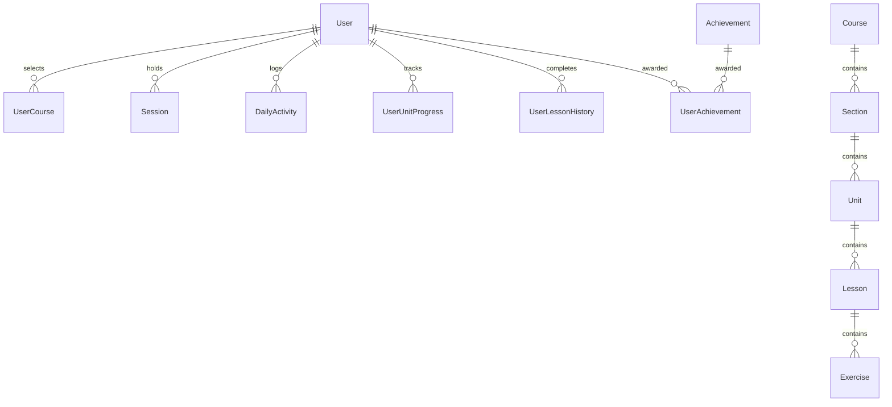

# Duolingo Clone

A full-stack Duolingo-inspired web app built with Django, Next.js, and SQLite. It replicates the core learning experience, including a visual skill path, interactive exercise lessons, hearts, XP, daily streaks, leaderboards, and user achievements.

> [!WARNING]
> **Privacy & Data Security Notice**:
> Do **NOT** use any real email address, real personal information, or any password you currently use or have used in the past. Please use dummy/mock data only.

---

## 🚀 Live Demo

- **Frontend:** [https://duolingo.aaryank.me](https://duolingo.aaryank.me) | [https://duolingo-clone-lovat-sigma.vercel.app/](https://duolingo-clone-lovat-sigma.vercel.app/)
- **Backend:** [https://duolingo-clone-xd1y.onrender.com](https://duolingo-clone-xd1y.onrender.com)

---

## Screenshots

[](https://duolingo.aaryank.me)

| Practicing Lesson | Profile Page | Login Page |
| :---: | :---: | :---: |
|  |  |  |

---

## Getting Started

### Prerequisites
- **Node.js**: v18+
- **Python**: 3.13

---

### 1. Backend Setup

```bash
cd backend
```

#### Linux & macOS
```bash
# Create virtual environment
python3 -m venv env
source env/bin/activate

# Install dependencies
pip install -r requirements.txt

# Run migrations and seed course content
python manage.py migrate
python manage.py seed_spanish

# Start Django backend (http://localhost:8000)
python manage.py runserver
```

#### Windows (Command Prompt / PowerShell)
```cmd
:: Create virtual environment
python -m venv env
env\Scripts\activate

:: Install dependencies
pip install -r requirements.txt

:: Run migrations and seed course content
python manage.py migrate
python manage.py seed_spanish

:: Start Django backend (http://localhost:8000)
python manage.py runserver
```

---

### 2. Frontend Setup

```bash
cd frontend

# Install dependencies
npm install

# Start Next.js dev server (http://localhost:3000)
npm run dev
```

---

## Features

- **Learning Path**: Visual tree of units and skills with lock/unlock state progression and dynamic scroll-based header banner.
- **Interactive Lessons**: Supports 5 exercise types: Multiple Choice, Word Bank (Tap-the-words), Match Pairs, Fill in the Blank, and Type Answer with sound synthesis.
- **Hearts & Health**: 5 max hearts. Deducted on incorrect answers, passively regenerated every 4 hours, or refilled in the shop.
- **XP & Daily Streaks**: Base XP awarded per lesson, daily activity tracking, and calendar-day streak counters.
- **Leaderboard**: Weekly and all-time rankings seeded with learner accounts.
- **Achievements**: Unlockable badges based on streaks and milestone progress.
- **Shop**: Gem economy to refill hearts.

---

## Tech Stack

- **Frontend**: Next.js 16.3.0, React 19, TypeScript, Tailwind CSS, Framer Motion, Zustand, TanStack React Query, Web Audio API.
- **Backend**: Python 3.13.8, Django 6.1, WhiteNoise, Gunicorn.
- **Database**: SQLite 3 (15 custom model tables).

> **Deployment Note:** SQLite is used for simplicity in this project and is suitable for this demonstration deployment. For production workloads with higher concurrent writes, PostgreSQL would be a more appropriate choice.

---

## How It Works

Go to [https://duolingo.aaryank.me](https://duolingo.aaryank.me). Click on **Get Started** to create a new account, or use these dummy credentials:
- **Email**: `test@test.com`
- **Password**: `test12345`

### Hearts System
- **Maximum Capacity**: Starts with **5 max hearts**.
- **Deduction on Error**: An incorrect answer deducts 1 heart in real time. Reaching 0 hearts blocks starting new lessons until hearts are refilled.
- **Passive Regeneration**: Automatically restores **1 heart every 4 hours**.
- **Shop Refill**: Users can spend **100 gems** in the Shop to instantly refill hearts to 5.

### Gems & Economy
- **Initial Balance**: Users receive an initial balance of **500 gems** upon account creation.
- **Earning Gems**: Completing lessons awards gems based on lesson completion and accuracy.
- **Heart Refill**: 100 gems can be spent in the Shop to refill hearts to 5.

### Streaks System
- **Calendar-Day Tracking**: A streak is based on calendar-day activity rather than a rolling 24-hour window.
- **Maintenance & Resets**: Completing at least one lesson on a calendar day maintains and increments the streak. Missing an entire calendar day resets the active streak counter to 0.

### XP System
- **Lesson Completion**: Completing a lesson grants base XP (+10 XP) plus bonus accuracy rewards.
- **Progress Tracking**: Accumulated XP updates total user XP, daily goal progress, and leaderboard standings.

### Leaderboard System
- **Dynamic Ranking**: Aggregates total XP across all registered users for weekly and all-time standings.
- **Competitor Seeding**: Pre-populated with realistic learner accounts for active ranking competition.

### Path & Unit Progression
- **Hierarchical Flow**: `Course` → `Section` → `Unit` → `Lesson` → `Exercise`.
- **Unlocking**: Completing all lessons in Unit $N$ unlocks Unit $N+1$ on the visual zigzag snake path.

---

## Admin Panel

Since the project is built with Django, it also includes Django's built-in Admin Panel. I decided to keep it enabled, as it can be useful for managing and creating courses, lessons, exercises, and other application data.

If you'd like to explore the Admin Panel, you can use the demo credentials below:

> [!NOTE]
> **Admin Panel — Demo Access**
>
> - **URL:** https://duolingo-clone-xd1y.onrender.com/admin/
> - **Username:** `demo`
> - **Password:** `demo123`
>
> **Read-Only Mode:** The demo account has restricted permissions. Users cannot create, update, or delete any data.

## Architecture

The application adopts a decoupled SPA architecture:
- **Frontend**: Next.js App Router providing client-side routing, state management via Zustand, data fetching via TanStack Query, and audio synthesis via Web Audio API.
- **Backend**: Django REST API backend responsible for exercise validation, heart regeneration algorithms, streak tracking, and user session management.
- **Data Persistence**: SQLite database normalized across 15 relational tables.

---

## Database Schema



The database consists of **15 custom model tables** across 5 Django apps (`users`, `courses`, `lessons`, `progress`, `gamification`).

---

## API Reference

Base URL: `/api`

### Auth & User Profile
| Method | Endpoint | Description | Auth Required |
| :--- | :--- | :--- | :---: |
| `POST` | `/api/auth/register/` | Register new user session | No |
| `POST` | `/api/auth/login/` | Log in user and return token | No |
| `POST` | `/api/auth/logout/` | Revoke user session | Yes |
| `GET` | `/api/profile/` | Fetch user profile, total XP, streak & achievements | Yes |
| `GET` | `/api/activity/today/` | Fetch today's XP gain and goal progress | Yes |

### Courses & Learning Path
| Method | Endpoint | Description | Auth Required |
| :--- | :--- | :--- | :---: |
| `GET` | `/api/courses/` | List available language courses | Yes |
| `POST` | `/api/courses/select/` | Select/activate language course | Yes |
| `GET` | `/api/courses/current/path/` | Fetch active course path (sections, units, lock/unlock status) | Yes |

### Lessons & Exercises
| Method | Endpoint | Description | Auth Required |
| :--- | :--- | :--- | :---: |
| `GET` | `/api/skills/<skill_id>/next-lesson/` | Fetch next lesson & exercise list for a unit | Yes |
| `POST` | `/api/lessons/exercises/<exercise_id>/submit/` | Validate exercise submission | Yes |
| `POST` | `/api/lessons/<lesson_id>/complete/` | Complete lesson, record XP, update streak & unit progress | Yes |

### Gamification & Shop
| Method | Endpoint | Description | Auth Required |
| :--- | :--- | :--- | :---: |
| `GET` | `/api/leaderboard/` | Fetch weekly / all-time rankings | Yes |
| `GET` | `/api/achievements/` | List achievements and unlock states | Yes |
| `POST` | `/api/hearts/refill-gems/` | Refill hearts balance to 5 using gems | Yes |

---

## Authentication & Security

### 🔐 Password Hashing with Argon2
- **Argon2id Variant**: Uses `Argon2id` (via `argon2-cffi` and Django's `Argon2PasswordHasher`).
- **Memory-Hard KDF**: Incorporates memory-hard key derivation requiring explicit memory allocation per hash computation.
- **Side-Channel & Trade-off Resistance**: Combines `Argon2i` (data-independent memory access for side-channel defense) and `Argon2d` (data-dependent memory access for time-memory trade-off defense).

### 🔑 Custom Session & Token Management
- **Cryptographic Tokens**: Generates 256-bit secure tokens (`secrets.token_hex(32)`) on login/registration.
- **Session Table**: Stored in a custom `Session` model with `created_at` and `expires_at` timestamps.
- **Dual Transport**: Supports both `Authorization: Bearer <token>` headers and HTTP-only session cookies (`session_token`).
- **Token Revocation**: `/api/auth/logout/` revokes active session tokens in the database instantly.

---

## Concurrency & Data Consistency

### 🛡️ Atomic Operations & Row Locking
- **Transaction Safety**: Uses `@transaction.atomic` blocks and `select_for_update()` row-level locks on user database records during heart deductions, gem refills, and XP awards.
- **Race Condition Prevention**: Prevents double-spending of gems or inconsistent heart counts during rapid concurrent API calls.

---

## Project Structure

```
duolingo-clone/
├── backend/
│   ├── common/              # Middleware, JSON helpers, exceptions
│   ├── courses/             # Course, Section, Unit models & seed script
│   ├── gamification/        # Leaderboard & Achievement services
│   ├── lessons/             # Lesson player, exercise validators
│   ├── progress/            # User progress tracking & lesson history
│   ├── users/               # Authentication, sessions & daily activity
│   ├── website/             # Django settings & root URL routing
│   ├── manage.py
│   └── requirements.txt
├── frontend/
│   ├── src/
│   │   ├── app/             # App Router pages (learn, lesson, leaderboard, profile, shop)
│   │   ├── components/      # UI components & 5 exercise renderers
│   │   ├── hooks/           # Custom React hooks
│   │   ├── lib/             # API client, sound synthesizer, helpers
│   │   ├── store/           # Zustand state management
│   │   └── types/           # TypeScript type definitions
│   ├── package.json
│   └── next.config.ts
└── README.md
```
